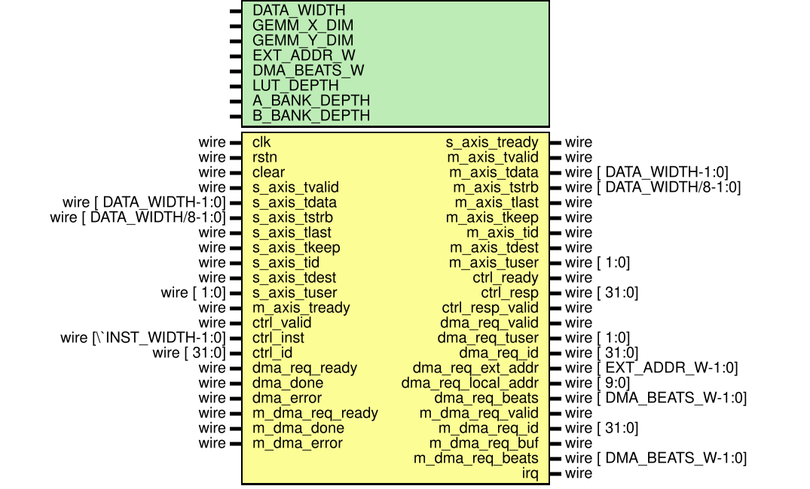

# Processing Tile Documentation

`Processing Tile (PT)` is the tile-level matrix engine used by the repository's Flash-Attention datapath. This document is the canonical architecture overview for the current RTL implementation in [`rtl/pt.v`](../../rtl/pt.v).

## 1. Documentation Map

- Architecture overview: [README.md](./README.md)
- Programmer and integration guide: [programming_guide.md](./programming_guide.md)
- Verification methodology: [verification_methodology.md](./verification_methodology.md)
- Top-level block diagram: [block_diagram.svg](./block_diagram.svg)

This directory is the authoritative home for PT documentation. Architecture, programming, and verification are split into three coordinated documents.

## 2. Role In The System

PT accepts tile-level control commands, fetches operand tiles A/B on demand, executes a full-tile GEMM, applies programmable quantization, can optionally run a post-quantization `MATADD` against an external B-style tile, retains the result in a dual-buffered M window, and automatically streams finished M tiles to an export DMA channel.

### 2.1 Main Submodules

| Module | Role | Current behavior |
| --- | --- | --- |
| [`PT`](../../rtl/pt.v) | Top wrapper | Connects the control plane, DMA interfaces, A/B/M storage, GEMM, QUANT, and merged response/interrupt handling |
| [`PT_MD`](../../rtl/pt_md.v) | Memory and dispatch | Parses control commands, maintains the LUT/cache, issues A/B load DMA requests, handles QCFG, and schedules M export |
| [`PT_CE`](../../rtl/pt_ce.v) | Compute engine | Reads operands from A/B banks or the M window, drives GEMM/QUANT, and writes quantized results into an M buffer |
| [`CSR_BANK`](../../rtl/csr_bank.v) | Internal PT CSR bank | Stores A/B base addresses and quantization state, and restores defaults after `clear` or `rstn` |
| [`PT_MEM_BANK`](../../rtl/pt_mem.v) | A/B bank primitive | Provides a dual-buffered lane SRAM view with lane writes and full-row reads |
| [`PT_M_MEM`](../../rtl/pt_mem.v) | M result storage | Stores row-major and column-major views simultaneously for M-window reuse and export |
| [`GEMM`](../../rtl/gemm.v) | Tile GEMM array | Runs with `OUTPUT_BY_ROW=1` and emits wide row groups |
| [`QUANT`](../../rtl/quant.v) | Post-GEMM quantizer | Applies inverse-scale Q16.16 rounding and saturation based on QCFG |
| [`GEMA`](../../rtl/gema.v) | Post-quant add | Applies signed lane-wise saturating add for `MATADD` |

`PT_MD` owns command admission, operand residency, and export scheduling. `PT_CE` owns execution and writeback. `CSR_BANK` is internal PT state, not an AXI-Lite front-end.

## 3. Top-Level Interfaces

### 3.1 Interface Groups

| Group | Ports | Meaning |
| --- | --- | --- |
| Clock and reset | `clk`, `rstn`, `clear` | `rstn` is the active-low global reset, and `clear` is a soft runtime flush |
| Control stream | `ctrl_valid`, `ctrl_ready`, `ctrl_inst`, `ctrl_id`, `ctrl_resp`, `ctrl_resp_valid` | Native PT command interface, not AXI-Lite |
| A/B load AXIS | `s_axis_*` | Tile payload return path after an A/B load DMA request is accepted |
| M export AXIS | `m_axis_*` | Automatic row-major export of quantized M tiles |
| A/B DMA request | `dma_req_*`, `dma_done`, `dma_error` | Requests external A/B tile loads; current RTL uses `dma_error`, while `dma_done` is only retained as wiring |
| M export DMA request | `m_dma_req_*`, `m_dma_done`, `m_dma_error` | Requests export of the currently ready M buffer |
| Completion and error notification | `irq` | Pulses on successful `MATMUL` completion and on error paths |

PT uses a native command/response interface plus two DMA-facing channels. It is not programmed directly through `csr_array`.

### 3.2 Parameters

| Parameter | Meaning |
| --- | --- |
| `DATA_WIDTH` | Datapath width for A/B input words and quantized M output words |
| `GEMM_X_DIM` | Tile row count, A operand height, and M output row count |
| `GEMM_Y_DIM` | Tile column count, B operand width, and M output column count |
| `EXT_ADDR_W` | External address width used by `dma_req_ext_addr` |
| `DMA_BEATS_W` | Width of DMA beat counters |
| `LUT_DEPTH` | Number of cache/LUT entries in `PT_MD` |
| `A_BANK_DEPTH` | Depth of each A-bank buffer |
| `B_BANK_DEPTH` | Depth of each B-bank buffer |

The current top level also derives:

- `M_DEPTH = A_BANK_DEPTH`
- `MAX_DIM = max(GEMM_X_DIM, GEMM_Y_DIM)`
- `QUEUE_LEN = 4`, defined in [`rtl/param.vh`](../../rtl/param.vh)

PT assumes square A and B tiles sized by `GEMM_X_DIM` and `GEMM_Y_DIM`, while M storage depth is tied to `A_BANK_DEPTH`.

## 4. Internal Dataflow

### 4.1 Main Path

1. `ctrl_*` commands enter the ingress FIFO inside `PT_MD`.
2. `PT_MD` updates `CSR_BANK` directly for `CFG`, enters a multi-beat configuration session for `QCFG`, and performs legality checks for `MATMUL` and `MATADD`.
3. For a legal matrix command, `PT_MD` checks the LUT/cache:
   - A cached external tile hit is rewritten into an internal local offset.
   - M-window operands are treated as hits by construction.
   - `MATMUL` may miss on A and/or B.
   - `MATADD` always uses an explicit M-window source on the left and may miss only on the external/B-style right operand.
   - A miss triggers one or more `dma_req_*` sequences and receives payload through `s_axis_*` into the A/B banks.
4. Once both operands are ready, the command is pushed through the CE issue FIFO into `PT_CE`.
5. `PT_CE` executes one of two datapaths:
   - `MATMUL`: reads operands from the A/B banks or from `PT_M_MEM`, drives [`GEMM`](../../rtl/gemm.v), then [`QUANT`](../../rtl/quant.v).
   - `MATADD`: reads one retained M row plus one external/B-bank row and drives [`GEMA`](../../rtl/gema.v).
6. `PT_CE` serializes each result row into the active M write buffer and returns a success `ctrl_resp` when the final row/final lane has been written.
8. After `ce_resp_valid`, `PT_MD` marks the corresponding M buffer as `READY` and automatically launches `m_dma_req_*` plus `m_axis_*` export.

Command processing is split into admission and residency (`PT_MD`) plus execution and writeback (`PT_CE`). Export is automatic after a successful compute; there is no separate export command.

### 4.2 Residency Model

- The A/B external tile cache is keyed primarily by `ctrl_id` and stores the most recent successfully loaded A/B external offset, local offset, and buffer selection for that ID.
- When a later command with the same `ctrl_id` references the same external tile, `PT_MD` can hit and skip the corresponding DMA.
- M-window reuse does not depend on the LUT. It is declared explicitly by bit 9 of `a_off` or `b_off`.
- `PT_MD` only issues work to `PT_CE` when the target M write buffer is `FREE`, preventing overwrite of a result that has not been exported yet.

A/B reuse is cache-by-`ctrl_id`, while M reuse is explicit through the offset encoding.

## 5. Storage And Double Buffering

### 5.1 A/B Banks

- `PT_MEM_BANK` builds two SRAM groups per lane to implement ping/pong buffering.
- The A bank writes are organized as row-selected lanes with column-progressing addresses.
- The B bank writes are organized as column-selected lanes with row-progressing addresses, matching the GEMM read pattern.
- `make_a_local_off()` and `make_b_local_off()` generate internal local offsets using the format `{1'b0, buf_sel, row_base_elem_off}`.

### 5.2 M Bank

- `PT_M_MEM` maintains three views:
  - `u_mem_col` for using retained M as an A operand
  - `u_mem_row_b` for using retained M as a B operand
  - `u_mem_row_exp` for row-major export
- `PT_CE` flips `m_wr_buf_ptr` after each successful completion, creating alternating M write buffers.
- `PT_MD` tracks `m_buf_state{0,1}` as `FREE`, `READY`, or `EXPORTING`.
- When both buffers are `READY`, the export scheduler prefers the buffer selected by `next_wr_buf` so the next compute can recover a writable buffer sooner.

The M store is not just a scratchpad. It keeps both row-wise and column-wise access patterns so a previous result tile can be reused as either operand without reshaping.

## 6. Execution State Summary

### 6.1 `PT_MD` Main FSM

| State | Function |
| --- | --- |
| `ST_IDLE` | Pops the next command, handles `CFG` directly, and starts a `QCFG` session or a legal matrix command |
| `ST_LUT_CHECK` | Determines whether the current `MATMUL`/`MATADD` sees external operands as hits or misses |
| `ST_DMA_REQ` | Issues an A/B load DMA request for the currently missing side |
| `ST_DMA_RECV` | Accepts `s_axis_tdata` into the A/B banks and may switch to the other missing side |
| `ST_ENQ_CE` | Pushes the patched `MATMUL`/`MATADD` into the CE issue queue |
| `ST_QCFG_LOAD` | Consumes QCFG payloads and commits them into `CSR_BANK` |

`PT_MD` also contains an independent export sub-FSM:

| Export substate | Function |
| --- | --- |
| `EXP_IDLE` | Waits for any M buffer to become `READY` |
| `EXP_REQ` | Issues `m_dma_req_*` |
| `EXP_STREAM` | Drives the full tile over `m_axis_*` |
| `EXP_WAIT_DONE` | Waits for `m_dma_done` or `m_dma_error` to complete export |

`PT_MD` multiplexes three jobs: command front-end, operand residency, and post-compute export scheduling.

### 6.2 `PT_CE` FSM

| State | Function |
| --- | --- |
| `ST_IDLE` | Waits for a valid command in the CE issue queue |
| `ST_EXEC_START` | Latches opcode, operand source selection, row bases, and the target M buffer |
| `ST_EXEC_FEED` | Feeds `GEMM_X_DIM` accumulation steps into GEMM for `MATMUL` |
| `ST_ADD_REQ/CAPTURE/SEND` | Reads one M row plus one B row and launches a `GEMA` transaction for `MATADD` |
| `ST_WAIT_RESULT` | Waits for the next result row from `QUANT` or `GEMA` |
| `ST_M_STORE` | Serializes one result row lane-by-lane into the M buffer |

When the final row and final lane are written, `PT_CE` produces:

- `ce_resp_valid = 1`
- `ce_resp = {err=0, m_buf=<target>, ctrl_id[29:0]}`
- `ce_irq = 1`

`PT_CE` is intentionally narrow: it only executes admitted work and does not own external DMA or QCFG parsing.

## 7. Reset And `clear`

- With active-low `rstn`, the runtime state of `PT_MD`, `PT_CE`, `CSR_BANK`, `GEMM`, and `QUANT` returns to defaults.
- `clear` is a soft flush that resets:
  - command queues and runtime registers
  - LUT/cache residency
  - A/B base CSR contents
  - `quant_mode` back to `PT_QGRAN_PER_TENSOR`
  - `quant_inv_scale` back to `0x0001_0000`
  - M buffer ownership state back to `FREE`
- The underlying SRAM macros in `PT_MEM_BANK` and `PT_M_MEM` are not physically scrubbed. `clear` only resets logical visibility and ownership/accounting state.

After `clear`, stale SRAM contents may still exist physically, but PT must treat them as unreachable because cache state, buffer ownership, and CSR state are reset.

## 8. Current Architectural Constraints

- `GEMM_X_DIM` and `GEMM_Y_DIM` must be powers of two. [`PT_MD`](../../rtl/pt_md.v) and [`PT_CE`](../../rtl/pt_ce.v) both raise `$fatal` during simulation startup for invalid dimensions.
- PT currently accepts only full-tile `MATMUL`: `M/N/K` must all be `PT_SCALE_FULL`.
- `MATADD` currently accepts only `M-window + external/B-style tile`.
- External A/B offsets must be tile-row aligned:
  - A must align to `GEMM_X_DIM` elements
  - B must align to `GEMM_Y_DIM` elements
- `QCFG` currently supports only `PT_QTYPE_SYMMETRIC` with a `PT_QCFG_CMD_HDR` header.
- `ctrl_resp` returns only `ctrl_id[29:0]`; if exact round-trip ID recovery matters, constrain `ctrl_id` to 30 bits.
- `dma_done` is not part of A/B load completion logic in the current RTL; load completion is determined by received beat count.

These constraints are architectural facts of the current RTL, not just testbench assumptions.

## 9. Related Sources

- Top level: [`rtl/pt.v`](../../rtl/pt.v)
- Memory and dispatch: [`rtl/pt_md.v`](../../rtl/pt_md.v)
- Compute engine: [`rtl/pt_ce.v`](../../rtl/pt_ce.v)
- PT storage: [`rtl/pt_mem.v`](../../rtl/pt_mem.v)
- Internal CSR bank: [`rtl/csr_bank.v`](../../rtl/csr_bank.v)
- Instruction definitions: [`rtl/param.vh`](../../rtl/param.vh)
- Quantizer: [`rtl/quant.v`](../../rtl/quant.v)
- Verification entry: [`sim/cocotb/run.py`](../../sim/cocotb/run.py)
