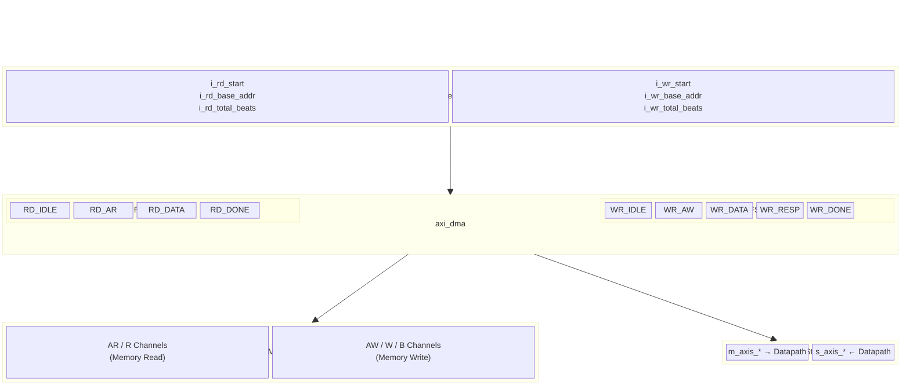
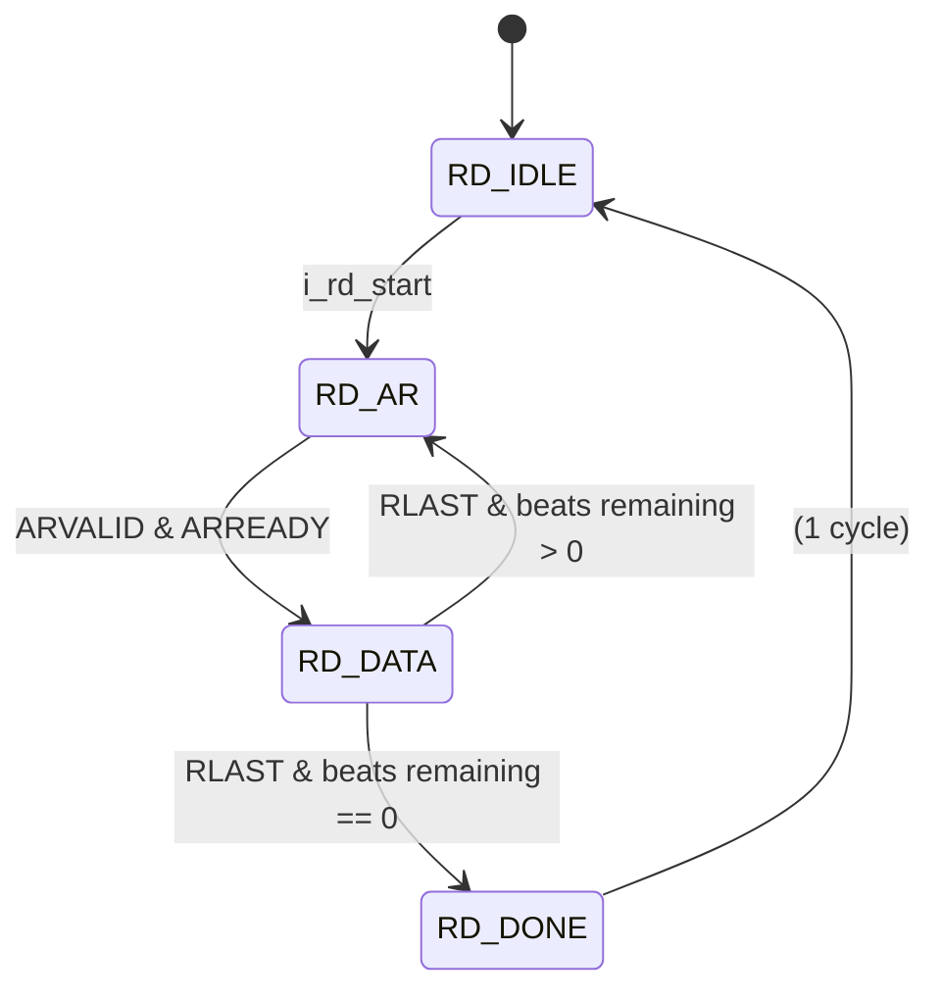
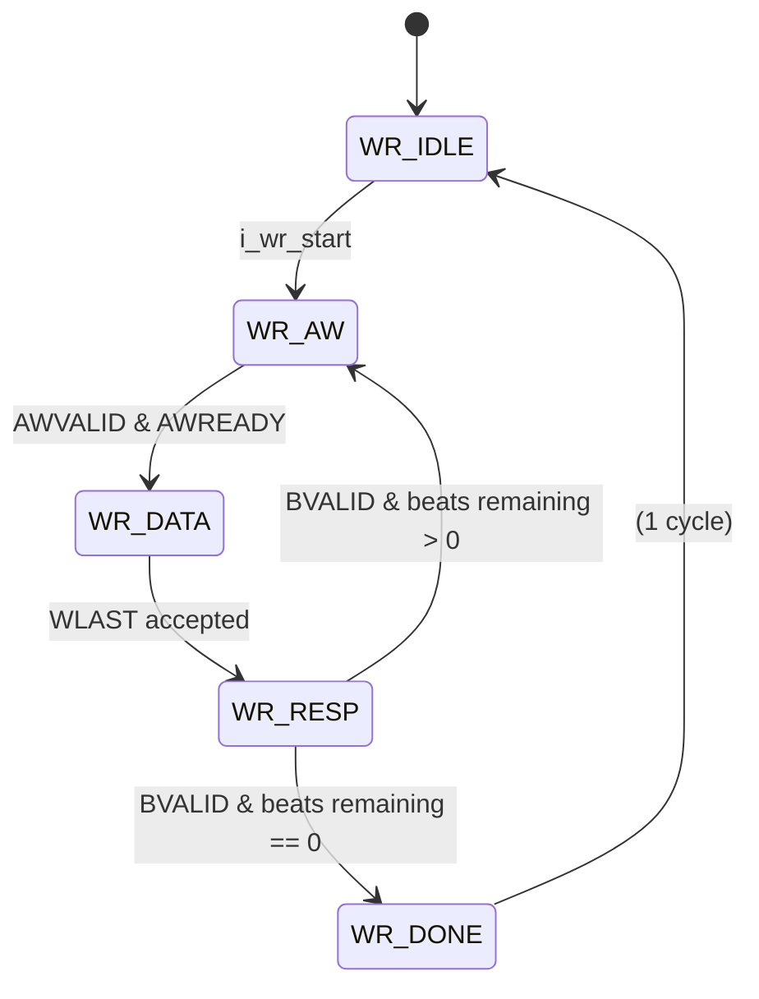

# AXI4 DMA Engine – Flash-Attention Accelerator

Bidirectional DMA with independent read and write datapaths.

---

## 1 Hardware

### 1.1 Block Diagram



### 1.2 Top-Level Architecture

```
                           ┌──────────────────────────────────────────────┐
                           │                 axi_dma                      │
                           │                                              │
  i_rd_start ─────────────►│  ┌────────────┐       ┌──────────────────┐  │
  i_rd_base_addr ─────────►│  │  Read FSM  │──AR──►│                  │  │──► m_axis_tdata
  i_rd_total_beats ────────►│  │            │◄──R───│                  │  │──► m_axis_tvalid
                           │  │ RD_IDLE     │       │                  │  │◄── m_axis_tready
  o_rd_busy ◄──────────────│  │ RD_AR       │       │   AXI4 Master    │  │──► m_axis_tlast
  o_rd_done ◄──────────────│  │ RD_DATA     │       │   Interface      │  │
  o_rd_error ◄─────────────│  │ RD_DONE     │       │                  │  │
                           │  └────────────┘       │  (AR/R + AW/W/B) │  │
                           │                        │                  │  │
  i_wr_start ─────────────►│  ┌────────────┐       │                  │  │◄── s_axis_tdata
  i_wr_base_addr ─────────►│  │  Write FSM │──AW──►│                  │  │◄── s_axis_tvalid
  i_wr_total_beats ────────►│  │            │──W───►│                  │  │──► s_axis_tready
                           │  │ WR_IDLE     │◄──B───│                  │  │◄── s_axis_tlast
  o_wr_busy ◄──────────────│  │ WR_AW       │       │                  │  │
  o_wr_done ◄──────────────│  │ WR_DATA     │       └──────────────────┘  │
  o_wr_error ◄─────────────│  │ WR_RESP     │                             │
                           │  │ WR_DONE     │                             │
                           │  └────────────┘                             │
                           └──────────────────────────────────────────────┘
                                       │              │
                                       ▼              ▼
                              AXI4 Read Bus    AXI4 Write Bus
                              (to Memory)      (to Memory)
```
### 1.3 System-Level Architecture
```
  DDR / HBM                    axi_dma                     Datapath
 ┌─────────┐    AXI4 Full    ┌──────────┐   AXI-Stream   ┌──────────┐
 │         │◄── AR ──────────│ Read FSM │── m_axis_* ───►│          │
 │  Memory │─── R  ─────────►│          │                 │ Attention│
 │         │◄── AW/W ────────│ Write FSM│◄─ s_axis_* ────│ Compute  │
 │         │─── B   ─────────►│          │                 │          │
 └─────────┘                  └──────────┘                 └──────────┘
   addressed                   translates                   address-free
   protocol                    between them                 protocol
```

### 1.4 Parameters

| Parameter | Default | Description |
| :-------- | :------ | :---------- |
| `ADDR_W`  | 40 | AXI address width (bits) |
| `DATA_W`  | 128 | AXI data width (bits) |
| `STRB_W`  | `DATA_W/8` | Write-strobe width (derived) |
| `ID_W`    | 4 | AXI transaction ID width |
| `LEN_W`   | 8 | Burst-length field width (8 → max 256 beats) |
| `MAX_BURST` | 256 | Maximum beats per AXI burst ($\le 2^{\text{LEN\_W}}$) |
| `BYTES_PER_BEAT` | `DATA_W/8` | Bytes transferred per beat (derived) |

### 1.5 Read Path – FSM Detail



| State | Activity |
| :---- | :------- |
| **RD_IDLE** | Latch `i_rd_base_addr` and `i_rd_total_beats` on start pulse. |
| **RD_AR** | Assert `ARVALID`; set `ARLEN` = min(remaining, MAX_BURST) − 1. Decrement `rd_beats_remaining` on handshake. |
| **RD_DATA** | Accept R-channel beats; forward to `m_axis_*` with back-pressure (`RREADY` = `m_axis_tready`). Flag `o_rd_error` on SLVERR/DECERR. Advance address on `RLAST`. |
| **RD_DONE** | Pulse `o_rd_done` for one cycle; return to idle. |

### 1.6 Write Path – FSM Detail



| State | Activity |
| :---- | :------- |
| **WR_IDLE** | Latch `i_wr_base_addr` and `i_wr_total_beats` on start pulse. |
| **WR_AW** | Assert `AWVALID`; set `AWLEN` = min(remaining, MAX_BURST) − 1. Decrement `wr_beats_remaining` on handshake. |
| **WR_DATA** | Pull data from `s_axis_*`; drive W channel with `WSTRB` = all-ones. Assert `WLAST` on final beat of each burst. Back-pressure: `s_axis_tready` = `m_axi_wready`. |
| **WR_RESP** | Wait for `BVALID`; flag `o_wr_error` on SLVERR/DECERR. Advance write address for next burst. |
| **WR_DONE** | Pulse `o_wr_done` for one cycle; return to idle. |

### 1.7 Port Summary

| Direction | Signal Group | Width | Purpose |
| :-------- | :----------- | :---- | :------ |
| in  | `aclk`, `aresetn` | 1 each | Clock and active-low reset |
| in  | `i_rd_start`, `i_rd_base_addr`, `i_rd_total_beats` | 1, 64, 32 | Read-side launch control |
| out | `o_rd_busy`, `o_rd_done`, `o_rd_error` | 1 each | Read-side status |
| in  | `i_wr_start`, `i_wr_base_addr`, `i_wr_total_beats` | 1, 64, 32 | Write-side launch control |
| out | `o_wr_busy`, `o_wr_done`, `o_wr_error` | 1 each | Write-side status |
| out | `m_axi_ar*` | various | AXI4 master read-address channel |
| in  | `m_axi_r*` | various | AXI4 master read-data channel |
| out | `m_axi_aw*` | various | AXI4 master write-address channel |
| out | `m_axi_w*` | various | AXI4 master write-data channel |
| in  | `m_axi_b*` | various | AXI4 master write-response channel |
| out | `m_axis_tdata/tvalid/tlast` | 256, 1, 1 | AXI-Stream master (read data → datapath) |
| in  | `m_axis_tready` | 1 | AXI-Stream master back-pressure |
| in  | `s_axis_tdata/tvalid/tlast` | 256, 1, 1 | AXI-Stream slave (datapath → write data) |
| out | `s_axis_tready` | 1 | AXI-Stream slave back-pressure |

### 1.8 AXI4 Protocol Details

* **Burst type** – INCR (`AxBURST = 2'b01`) for both read and write.
* **Burst size** – Full data-bus width (`AxSIZE = $\log_2(\text{BYTES\_PER\_BEAT})$`).
* **Cache / Prot** – `AxCACHE = 4'b0011` (bufferable, modifiable); `AxPROT = 3'b000`.
* **ID** – Fixed at 0 for both read and write channels.
* **Reset** – Active-low (`aresetn`). All outputs deasserted; counters zeroed.

---

## 2 Software

### 2.1 Sequencer Integration

The DMA is not directly register-mapped from the host CPU. Instead, a hardware **sequencer** (or the CSR array) drives the control ports. A typical flow:

1. Host writes Q/K/V/O base addresses and stride into the CSR array.
2. Host writes `START` bit in CTRL.
3. The sequencer computes beat counts from the known matrix dimensions:
   - Read beats for Q: $S \times d \times 2 \;/\; \text{BYTES\_PER\_BEAT}$
   - Read beats for K, V: same formula.
   - Write beats for O: same formula.
4. Sequencer pulses `i_rd_start` with the Q base address, waits for `o_rd_done`, then repeats for K and V.
5. After the datapath produces output, the sequencer pulses `i_wr_start` with the O base address.
6. On `o_wr_done`, sequencer asserts `i_done` back to the CSR `STATUS` register.

### 2.2 Beat Count Calculation

For a matrix of size $S \times d$ stored in 16-bit (2-byte) elements with `DATA_W = 256` (32 bytes per beat):

$$
\text{total\_beats} = \frac{S \times d \times 2}{\text{BYTES\_PER\_BEAT}} = \frac{256 \times 64 \times 2}{32} = 1024
$$

### 2.3 Error Handling

| Flag | Cause | Recovery |
| :--- | :---- | :------- |
| `o_rd_error` | AXI RRESP[1] = 1 (SLVERR or DECERR) | Sticky until next `i_rd_start`. Check after `o_rd_done`. |
| `o_wr_error` | AXI BRESP[1] = 1 (SLVERR or DECERR) | Sticky until next `i_wr_start`. Check after `o_wr_done`. |

Software should check both error flags after each transfer completes and report via the CSR `STATUS.ERROR` bit.

### 2.4 Simulation / Verification

Use an AXI4 memory model (e.g., cocotbext-axi `AxiRam`) connected to the `m_axi_*` ports and an AXI-Stream driver/monitor for the `m_axis_*` / `s_axis_*` ports.

---

## 3 Future Extensions

| Area | Planned Change | Impact |
| :--- | :------------- | :----- |
| **Outstanding transactions** | Allow multiple AR/AW in flight (pipelining) with a configurable depth. | Higher throughput; needs ID tracking and reorder buffer. |
| **4 KB boundary splitting** | Automatically split bursts that would cross a 4 KB address boundary (AXI spec requirement). | Additional address arithmetic in AR/AW states. |
| **Scatter-gather** | Add a descriptor-ring interface so the sequencer can queue multiple DMA transfers without polling. | New descriptor-fetch FSM; shared memory descriptor format. |
| **Write strobing** | Support partial-beat writes (non-full `WSTRB`) for the last beat of an unaligned transfer. | Adds `i_wr_last_strb` control input. |
| **Read/write arbitration** | Merge onto a single AXI port with round-robin or priority arbitration. | Reduces interconnect ports; adds an arbiter sub-module. |
| **Data width converter** | Support mismatched datapath and memory bus widths (e.g., 128-bit datapath on 256-bit bus). | Adds up/down-sizer logic between stream and AXI channels. |
| **Performance counters** | Count total cycles, stall cycles, and bytes transferred per path. | Read-only status registers or sideband outputs. |

---
