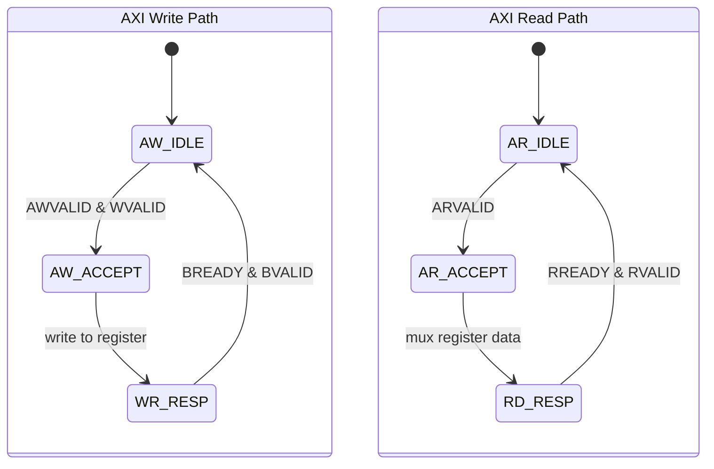
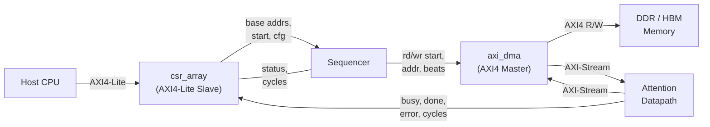

# CSR Array – Flash-Attention Accelerator

Baseline parameters: **S = 256**, **d = 64**.

---

## 1 Hardware

### 1.1 Block Overview

The `csr_array` module exposes all control/status registers for the Flash-Attention accelerator through a standard **AXI4-Lite slave** interface. It sits between the host processor bus and the datapath, providing:

* Run-time configuration (base addresses, scaling constants, stride).
* Start / soft-reset / IRQ-enable control bits.
* Read-only status feedback (busy, done, error, cycle count).

### 1.2 Block Diagram

```
  Host CPU / Interconnect
         │
         │  AXI4-Lite (32-bit)
         ▼
  ┌──────────────────────────────────────────────────────────┐
  │                      csr_array                           │
  │                                                          │
  │   AXI4-Lite          ┌──────────────────┐                │
  │   Slave I/F    ────► │  R/W Registers   │ ──────────────►│──► o_start
  │  ┌──────────┐        │                  │                │──► o_soft_reset
  │  │ AW / W   │──wr──► │  CTRL            │                │──► o_irq_en
  │  │ Channel  │        │  CFG             │ ──────────────►│──► o_causal_en
  │  └──────────┘        │  Q/K/V/O_BASE    │ ──────────────►│──► o_q_base [63:0]
  │  ┌──────────┐        │  STRIDE_BYTES    │                │──► o_k_base [63:0]
  │  │ AR / R   │◄─rd──  │  NEG_LARGE       │                │──► o_v_base [63:0]
  │  │ Channel  │        │  SCALE           │                │──► o_o_base [63:0]
  │  └──────────┘        └──────────────────┘                │──► o_stride_bytes
  │                       ┌──────────────────┐               │──► o_neg_large
  │                       │  R/O Registers   │               │──► o_scale
  │               ◄────── │  STATUS          │ ◄─────────────│◄── i_busy
  │                       │  CYCLES          │               │◄── i_done
  │                       └──────────────────┘               │◄── i_error
  │                                                          │◄── i_cycles [31:0]
  └──────────────────────────────────────────────────────────┘
```



### 1.3 System Context



### 1.4 Parameters

| Parameter | Default | Description |
| :-------- | :------ | :---------- |
| `DATA_W`  | 32      | Data bus width (bits) |
| `ADDR_W`  | 7       | Address bus width – covers offsets 0x00 – 0x40 |
| `STRB_W`  | `DATA_W/8` | Write-strobe width (derived) |

### 1.5 Register Map

| Offset | Name | Access | Description |
| :----- | :--- | :----- | :---------- |
| **0x00** | CTRL | R/W | bit 0: `START` – launch computation<br>bit 1: `SOFT_RESET` – reset datapath<br>bit 2: `IRQ_EN` – enable done/error interrupt |
| **0x04** | STATUS | R | bit 0: `BUSY`<br>bit 1: `DONE`<br>bit 2: `ERROR` |
| **0x08** | CFG | R/W | bit 0: `CAUSAL_EN` – enable causal (triangular) mask<br>bits 31:1: reserved |
| **0x14** | Q\_BASE\_L | R/W | Q matrix base address [31:0] |
| **0x18** | Q\_BASE\_H | R/W | Q matrix base address [63:32] |
| **0x1C** | K\_BASE\_L | R/W | K matrix base address [31:0] |
| **0x20** | K\_BASE\_H | R/W | K matrix base address [63:32] |
| **0x24** | V\_BASE\_L | R/W | V matrix base address [31:0] |
| **0x28** | V\_BASE\_H | R/W | V matrix base address [63:32] |
| **0x2C** | O\_BASE\_L | R/W | O (output) matrix base address [31:0] |
| **0x30** | O\_BASE\_H | R/W | O (output) matrix base address [63:32] |
| **0x34** | STRIDE\_BYTES | R/W | Row stride in bytes (default: $d \times 2$) |
| **0x38** | NEG\_LARGE | R/W | Large negative value used as $-\infty$ approximation (Q8.8 fixed-point) |
| **0x3C** | SCALE | R/W | Scaling constant $1/\sqrt{d}$ |
| **0x40** | CYCLES | R | Hardware cycle counter – latched at completion |

> **Note:** Offsets 0x0C and 0x10 are currently unmapped and reserved.

### 1.6 AXI4-Lite Protocol Details

* **Write path** – The module requires both `AWVALID` and `WVALID` to be asserted before it accepts a write. Byte-level write strobes (`WSTRB`) are honoured for every R/W register. Writes to read-only or unmapped addresses are silently ignored (BRESP = OKAY).
* **Read path** – A combinational mux selects the register contents addressed by `ARADDR`. The data is registered into `RDATA` on the next clock edge after the AR handshake.
* **Reset** – Active-low asynchronous reset (`aresetn`). All registers and handshake signals return to zero on reset.

### 1.7 Port Summary

| Direction | Signal Group | Width | Purpose |
| :-------- | :----------- | :---- | :------ |
| in  | `aclk`, `aresetn` | 1 each | Clock and active-low reset |
| in/out | `s_axi_*` | various | AXI4-Lite slave interface |
| out | `o_start`, `o_soft_reset`, `o_irq_en`, `o_causal_en` | 1 each | Control flags to datapath |
| out | `o_q_base`, `o_k_base`, `o_v_base`, `o_o_base` | 64 each | Matrix base addresses |
| out | `o_stride_bytes`, `o_neg_large`, `o_scale` | 32 each | Datapath parameters |
| in  | `i_busy`, `i_done`, `i_error` | 1 each | Datapath status flags |
| in  | `i_cycles` | 32 | Cycle count from datapath |

---

## 2 Software

### 2.1 Programming Model (Bare-Metal)

A typical launch sequence from the host processor:

```c
#include <stdint.h>

#define CSR_BASE      0x4000_0000   // example AXI base address

#define REG_CTRL         (CSR_BASE + 0x00)
#define REG_STATUS       (CSR_BASE + 0x04)
#define REG_CFG          (CSR_BASE + 0x08)
#define REG_Q_BASE_L     (CSR_BASE + 0x14)
#define REG_Q_BASE_H     (CSR_BASE + 0x18)
#define REG_K_BASE_L     (CSR_BASE + 0x1C)
#define REG_K_BASE_H     (CSR_BASE + 0x20)
#define REG_V_BASE_L     (CSR_BASE + 0x24)
#define REG_V_BASE_H     (CSR_BASE + 0x28)
#define REG_O_BASE_L     (CSR_BASE + 0x2C)
#define REG_O_BASE_H     (CSR_BASE + 0x30)
#define REG_STRIDE_BYTES (CSR_BASE + 0x34)
#define REG_NEG_LARGE    (CSR_BASE + 0x38)
#define REG_SCALE        (CSR_BASE + 0x3C)
#define REG_CYCLES       (CSR_BASE + 0x40)

#define WR32(addr, val) (*(volatile uint32_t *)(addr) = (val))
#define RD32(addr)      (*(volatile uint32_t *)(addr))

void flash_attn_launch(uint64_t q, uint64_t k, uint64_t v, uint64_t o,
                       uint32_t stride, uint32_t scale, int causal)
{
    /* 1. Soft-reset the datapath */
    WR32(REG_CTRL, 0x2);           // SOFT_RESET
    WR32(REG_CTRL, 0x0);           // release reset

    /* 2. Configure matrix base addresses */
    WR32(REG_Q_BASE_L, (uint32_t)(q));
    WR32(REG_Q_BASE_H, (uint32_t)(q >> 32));
    WR32(REG_K_BASE_L, (uint32_t)(k));
    WR32(REG_K_BASE_H, (uint32_t)(k >> 32));
    WR32(REG_V_BASE_L, (uint32_t)(v));
    WR32(REG_V_BASE_H, (uint32_t)(v >> 32));
    WR32(REG_O_BASE_L, (uint32_t)(o));
    WR32(REG_O_BASE_H, (uint32_t)(o >> 32));

    /* 3. Datapath parameters */
    WR32(REG_STRIDE_BYTES, stride);
    WR32(REG_SCALE, scale);
    WR32(REG_NEG_LARGE, 0xFF00);   // example: -256 in Q8.8
    WR32(REG_CFG, causal ? 0x1 : 0x0);

    /* 4. Start with IRQ enabled */
    WR32(REG_CTRL, 0x5);           // START | IRQ_EN
}

int flash_attn_poll(uint32_t *cycles_out)
{
    uint32_t status;
    do {
        status = RD32(REG_STATUS);
    } while (status & 0x1);        // wait while BUSY

    if (cycles_out)
        *cycles_out = RD32(REG_CYCLES);

    return (status & 0x4) ? -1 : 0; // return -1 on ERROR
}
```

### 2.2 Linux / UIO Driver Notes

When mapped through a UIO or devmem driver:

1. Map the CSR physical range (`CSR_BASE`, 128 bytes) into user-space.
2. Use the same register offsets shown above.
3. For interrupt-driven operation, enable `IRQ_EN` (bit 2 of CTRL) and wait on the UIO file descriptor.

### 2.3 Cocotb / Simulation Test

The repository includes a Python-based test under [scripts/test_csr_array.py](../scripts/test_csr_array.py) that exercises all registers through an AXI4-Lite BFM.

---

## 3 Future Extensions

| Area | Planned Change | Impact |
| :--- | :------------- | :----- |
| **Sequence length** | Add `SEQ_LEN` register (offset 0x0C) and `HEAD_DIM` register (offset 0x10) to support variable S and d at run-time. | Two new R/W registers; requires datapath changes. |
| **Multi-head support** | Add `NUM_HEADS` and `HEAD_STRIDE` registers so the accelerator can iterate over multiple attention heads without CPU intervention. | New address offsets; adds an outer loop in the sequencer. |
| **Performance counters** | Extend read-only region with stall-cycle, cache-miss, and bandwidth counters for profiling. | Additional read-only registers beyond 0x40. |
| **Interrupt status** | Add a dedicated `IRQ_STATUS` / `IRQ_CLEAR` register pair for edge-triggered, write-1-to-clear interrupt handling. | Replaces current level-based done/error polling. |
| **AXI4 full upgrade** | Migrate from AXI4-Lite to AXI4 (burst) on the CSR interface for consistency with the data-plane bus. | Wider address decode; backward-compatible at the register level. |
| **Register protection** | Implement a lock bit in CTRL that prevents further writes to configuration registers while the datapath is busy. | Adds a hardware interlock; prevents mid-run corruption. |
| **ECC / Parity** | Add optional ECC on register storage for safety-critical deployments. | Parameterized; increases area slightly. |

---